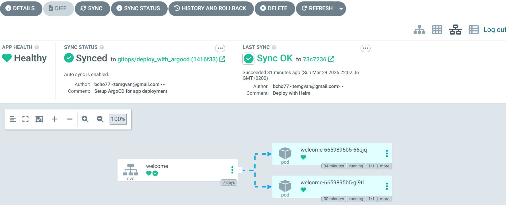

# 🚀 DevOps CI/CD GitOps Project

## 📌 Overview

This project demonstrates a complete **end-to-end DevOps pipeline** using modern tools and best practices.

The objective is to build and deploy a simple Flask application while practicing:

- Continuous Integration (CI) with Jenkins  
- Containerization with Docker  
- Continuous Deployment (CD) using GitOps principles  
- Kubernetes deployment using Helm  
- Automated deployment and synchronization with Argo CD  

---

## 🧱 Project Architecture

Developer → GitHub → Jenkins → Docker Hub → Git (Helm values)
↓
Argo CD
↓
Kubernetes (Minikube)

---

## ⚙️ Tech Stack

- **Backend:** Flask (Python)
- **CI/CD:** Jenkins
- **Containerization:** Docker
- **Orchestration:** Kubernetes
- **Package Manager:** Helm
- **GitOps Tool:** Argo CD
- **Local Cluster:** Minikube
- **Container Registry:** Docker Hub

---

## 🧪 Application

A simple Flask application that returns: Welcome to my world

---

## 🔄 CI/CD + GitOps Workflow

### 1️⃣ Code Development
- Develop a simple Flask application  
- Push source code to GitHub  

### 2️⃣ Continuous Integration (Jenkins)
Jenkins automates the following steps:

- Clone the repository  
- Build the Docker image  
- Tag the image using the Jenkins build number  
- Push the image to Docker Hub  
- Update the Helm chart (`values.yaml`) with the new image tag  
- Commit and push changes back to GitHub  

This commit triggers the GitOps deployment process.

### 3️⃣ Docker
- The application is packaged into a Docker image  
- All dependencies are included inside the image  
- The image is stored in Docker Hub  

### 4️⃣ Kubernetes Deployment with Helm
- Helm is used to define Kubernetes resources:
  - Deployment  
  - Service  
  - Image configuration  
- The application is deployed into the Kubernetes cluster (Minikube)

### 5️⃣ GitOps with Argo CD
- Argo CD monitors the Git repository  
- Detects changes in Helm configuration  
- Automatically synchronizes and deploys updates to Kubernetes  

---

## 🚀 Deployment Flow
Jenkins → Build → Push Image → Update Helm → Git Push
→ Argo CD detects change → Deploy to Kubernetes

## 🚀 Deployment Result

